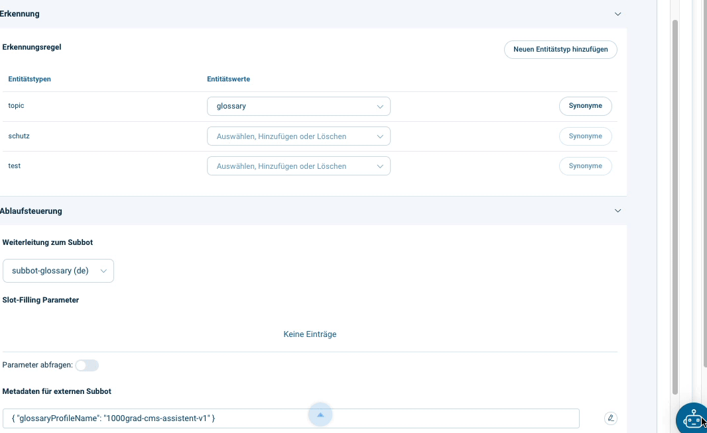

# Automatically link words in a chatbot message to glossary descriptions.
## Introduction
One of the most frequently used channels of the Kiko Chatbot (https://www.kiko.bot) is webchat. There, web links can be used to display linked web pages in an integrated info area.
We use this function in this tutorial and automatically display linked glossary descriptions there.

## General process
The linking of the words and the output of the changed message is done by an external subbot with its own web service for this task. This subbot is assigned to the intents whose output is to be linked.

To determine the linkable words, the external subbot's web service sends all the words in the message to a glossary database (another web service) and receives back a list of linkable words and the link to the description. With this information, all relevant words can be replaced in the message with the corresponding links. 

## Look at the code

### src/index.js

The processing of the subbot request from the Kiko server takes place in the file src/index.js.

At the beginning the web server is initialised.
The route "/v1/webhook-message-sent" is entered in the webhook of the subbot.

```javascript
const app = express()
app.use(cors())
app.use(compress())
app.use(bodyParser.urlencoded({ extended: true }))
app.use(bodyParser.json())
app.post('/v1/webhook-message-sent', Functions.postWebhookMessageSent)
```
### src/functions.js

### postWebhookMessageSent
The property "glossaryProfileName" contains the name of the glossary database in which the linkable words are stored.

```javascript
async function postWebhookMessageSent (req, res) {
  const { conversationId, messages } = req.body
  const referer = req.get('referer') || req.query.referer
  const endpointBaseUrl = referer.replace(/\/\//g, 'https://')
  const metadata = messages[0].metaData
  if (metadata) { 
    await sendOutputWithLinkedGlossaryWords({ 
      messages: metadata.intent.output, 
      conversationId: conversationId, 
      endpointBaseUrl: endpointBaseUrl,
      glossaryProfileName: metadata.glossaryProfileName
    })
  }
  res.status(200).json({ success: true })
}
```

### sendOutputWithLinkedGlossaryWords
In this function, all messages to be output from the previously recognised chatbot intent are processed individually. If it is a text-only message, all words are detected. Via the function "getGlossaryDescriptionLinks", the corresponding links are fetched from the glossary database.

All links are transferred to the message via a replace function. Because the message now contains links, it is sent as an HTML message.

```javascript
async function sendOutputWithLinkedGlossaryWords (options) {
  const { messages, conversationId, endpointBaseUrl, glossaryProfileName } = options
  const outputMessages = []
  for (const msg of messages) {
    let outputMessage
    if (
      msg.type === 'message' &&
      msg.data &&
      msg.data.type === 'text/plain'
    ) {
      const R =  /(\w|\s)*\w(?=")|\w+/g
      const words = msg.data.content.match(R)
      const uniqueWords = words.filter((v, i, a) => a.indexOf(v) === i)
      
      const glossaryLinks = await getlinks({
        words: uniqueWords, 
        glossaryProfileName: glossaryProfileName
      })
      
      let htmlContent = '<p>' + msg.data.content + '</p>'
      for (const glossaryLink of glossaryLinks) {
        const link = '<a href="' + glossaryLink.url + '" target="_self" >' + glossaryLink.word + '</a>'
        htmlContent = htmlContent.replace(new RegExp(glossaryLink.word, 'g'), link)
      }
      outputMessage = {
        type: 'message',
        data: {
          type: 'text/html',
          content: htmlContent
        }
      }      
    } else {
      outputMessage = msg
    }
    outputMessages.push(outputMessage)
  }
  outputMessages.push(eocEvent)
  await sendOutputMessages({ messages: outputMessages, endpointBaseUrl, conversationId })
}
```

## Deployment
Deploy this app to your account in Google Cloud Run. Your webservice url is something like this: https://kiko-glossary-guide-....a.run.app.

## Kiko Integration
- Create your own Kiko CMS account: https://www.kiko.bot/kostenlos-registrieren-chatbot-cms/
- Create an external subbot with the name "subbot-glossary" in the CMS via the menu "Botlist". 
- Enter the URL of the published web service in the subbot via the submenu item "Edit webhooks" in the field "Receive message": https://kiko-glossary-guide-....a.run.app/v1/webhook-message-sent
- Create an intent with the name "Example output" via the "Content" menu in the "metabot" enter "subbot-glossary" as the subbot's forwarding.
- Enter the text value "This is a sample sentence with the word CMS" in "Content" under "Result".
- For recognition, create the entity type "topic" with the entity value "glossary".
- Enter the following value in "Flow control" under "Metadata for external subbot"
```json
{
  "glossaryProfileName": "1000grad-cms-assistent-v1"
}
```
- Leave the field "Query parameters" deactivated.
- Publish the bot with the intent and the external subbot via the menu "Botlist"

## Test
Type "glossary" in the test webchat input. The intent should be recognised and the word "CMS" should be linked in the output.

By clicking on the link, the info area should open above the test webchat with an explanation of the terms. The info area can be closed again with a click.

## Result

